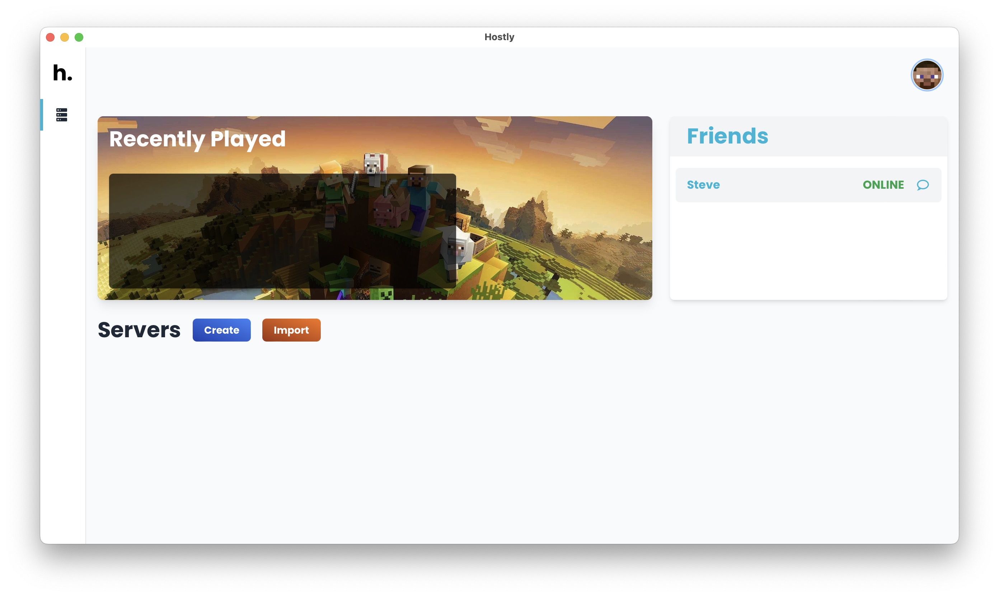

# **Hostly**

This is an application to manage servers of Minecraft, providing synchronization between different services such as FPT, SFTP, AWS. This app allows you to manage your servers and hosting in a simple way.




# Current features

- Create, edit and delete servers
- Manage JVM instances.
- Easy step-by-step installation.
- Host Minecraft servers in a few clicks.
- Sync your server data within your hosting provider (FTP, SFTP, AWS).

# Current state of development

- [x] Desktop app in different platforms (Windows, Linux, Mac).
- [ ] Chat and Friends system. (There's placeholder code in frontend for this, but it's not working yet).
- [ ] Daemon to manage the servers instead of the desktop app.
- [ ] Better documentation.
- [ ] ...

# How to install

Install the Python dependencies:

```bash
pip install -r requirements.txt
```

Install the Node dependencies:

```bash
npm install
```

# How to run

Run the Desktop app:

```bash
make frontend
```

Run the Frontend (Web):

```bash
make run
```

# How to build

## MacOS

Some libraries may be required in order to compile, i needed to install the following:

```bash
pip3 install importlib_metadata zipp pathlib2
```
    
Then, run the following command:

```bash
python3 build-macos.py py2app
```

Finally, you can find the app in the `dist` folder and move it to the `Applications` folder.

## Windows & Linux

When I was developing this app (1 year ago) I successfully compiled for Windows and Linux, using pyinstaller and .spec files.